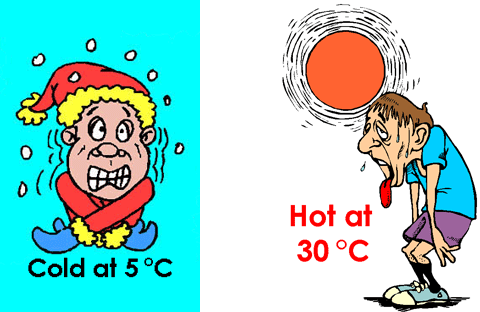
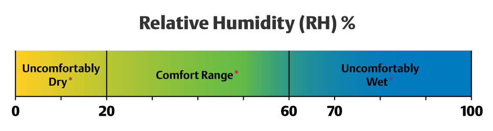
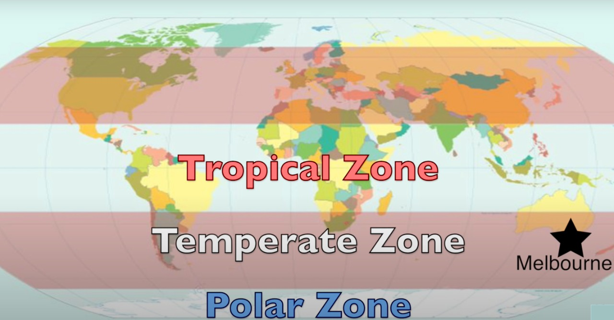

background-image: url(https://images.unsplash.com/photo-1536514498073-50e69d39c6cf?ixid=MnwxMjA3fDB8MHxwaG90by1wYWdlfHx8fGVufDB8fHx8&ixlib=rb-1.2.1&auto=format&fit=crop&w=1742&q=80)
background-position: 50% 50%

```{r setup, include=FALSE}
options(htmltools.dir.version = FALSE)
```

class: center, middle
# Introduction

*'If you don't like the weather in Melbourne, just wait five minutes'*, says Ancient Wisdom.

Melbourne is the SouthEastern part of mainland Australia, under the state Victoria. This city is known for its fickle and unpredictable weather and is said to have four seasons in one day.

```{r out.width = '60%', echo = FALSE, fig.align="center"}

```

.tiny[<span>Photo by <a href="https://www.gizmodo.com.au/author/loganbooker/">Logan Booker</a> on <a href="https://www.gizmodo.com.au/2016/02/experience-australias-four-seasons-in-this-beautiful-melbourne-timelapse/">Gizmodo</a></span>]

---
background-image: url(https://images.unsplash.com/photo-1536514498073-50e69d39c6cf?ixid=MnwxMjA3fDB8MHxwaG90by1wYWdlfHx8fGVufDB8fHx8&ixlib=rb-1.2.1&auto=format&fit=crop&w=1742&q=80)

class: left, top

**AIM**: The aim of our analysis is to find out if the statement "Melbourne experiences four seasons in one day" is true or not.

**Data used**: The data used for the analysis contains weather parameters like **windspeed, humidity, temperature**, air quality and pressure for the months **May'21 to October'21** (for each day, time-wise) for **nine locations of Melbourne** which are displayed below.

```{r, echo = FALSE, message = FALSE, warning = FALSE}
library(readr)
library(here)
D1 <- read_csv(here::here("locations.csv"))
D2 <- read_csv(here::here("weather.csv"))
```

```{r, echo = FALSE, message = FALSE, warning = FALSE}
library(tidyverse)
D4 <- data.frame(names=c("Carpark (near Bababoi), 3008", "Flinders Street (near Young & Jackson), 3000","Spring Street, 3000", "Carpark (near Flinders Street), 3008","Little Collins Street, 3000", "Siddeley Street, 3008", "Lonsdale Street, 3000", "William Street, 3000", "Flinders Lane (near Centro Espresso Cafe), 3000"),
                 site_id= c("1010", "1014", "1015", "1011", "1012", "1007", "1016", "1013", "1009")) %>% 
  mutate(site_id=as.numeric(site_id))
D3 <- full_join(D4, D1, by="site_id")
```

```{r, echo = FALSE, message = FALSE, warning = FALSE, fig.width=10, fig.height=5}
library(leaflet)
library(maps)
leaflet(data = D3) %>% 
addTiles()%>%
  addMarkers(
    ~longitude, 
    ~latitude, 
    popup = paste("Area Name:",D3$names),
    )
```
---
background-image: url(https://images.unsplash.com/photo-1536514498073-50e69d39c6cf?ixid=MnwxMjA3fDB8MHxwaG90by1wYWdlfHx8fGVufDB8fHx8&ixlib=rb-1.2.1&auto=format&fit=crop&w=1742&q=80)

class: left, top

# Methodology
.content-box-duke-green[ 
We find out the **weather conditions for each hour in each day** for the months given to identify the seasons present in a day.The weather quantities used for the same are : *Temperature (°C), Average Windspeed (kmh)* and *Relative Humidity (%)*.
 ]
 
**Temperature**: It is a physical quantity that expresses degree of hotness and coldness. The higher the temperature, the hotter the weather.

```{r, echo = FALSE, out.width='35%'}

```

.tiny[<span>Photo on <a href="https://thinkmetric.uk/basics/temperature/">Think Metric</a>,website by <a href="https://wordpress.com">Wordpress.com</a></span>]

---
background-image: url(https://images.unsplash.com/photo-1536514498073-50e69d39c6cf?ixid=MnwxMjA3fDB8MHxwaG90by1wYWdlfHx8fGVufDB8fHx8&ixlib=rb-1.2.1&auto=format&fit=crop&w=1742&q=80)

**Average Windspeed**: It is an atmospheric quantity and is caused when air moves from high pressure to low pressure, due to changes in temperature.
Melbourne experiences .green[summer from Dec-Feb with an average windspeed of 12.5kmh,] .red[autumn from March to May with an average windspeed of 13.8kmh,] .blue[Winter from June-Aug and the average windspeed is 15.4kmh and can go up to 16.8kmh.] .purple[and spring is from Sept-Nov with an average windspeed of 15.5kmh.]
Therefore, *higher wind speeds, can lead to "spring" experience.*

**Relative Humidity**: This is measured in percent(%) measuring the moisture content in the atmosphere. .green[0% means that the atmosphere has dry air] .red[ and 100% means that the air is moist.] *The humidity is usually the highest in summer.*

```{r out.width = '80%', echo = FALSE}

```

.tiny[<span>Photo on <a href="https://www.ac-heatingconnect.com/homeowners/cold-weather-home-humidity/">AC and Heating Connect</a> by <a href="https://www.ac-heatingconnect.com/author/frank-author/">Frank Landwehr</a></span>]

---
background-image: url(https://images.unsplash.com/photo-1536514498073-50e69d39c6cf?ixid=MnwxMjA3fDB8MHxwaG90by1wYWdlfHx8fGVufDB8fHx8&ixlib=rb-1.2.1&auto=format&fit=crop&w=1742&q=80)

# Analysis
**a)Plot shows variation in temperature on each day of the week for the given months for the mentioned nine locations in Melbourne.**

.pull-left[

```{r, echo = FALSE, message = FALSE, warning = FALSE, out.width='150%'}
library(ggridges)
library(ggplot2)
library(viridis)
temp1 <- D2 %>%
  select(gateway_hub_id, minute, wday, 
         ambient_temperature_celsius) %>% 
  na.omit()%>%
  group_by( wday)

ggplot(temp1, aes(x = ambient_temperature_celsius, y = wday, fill = ..x..)) +
  geom_density_ridges_gradient(scale = 3, rel_min_height = 0.01) +
  scale_fill_viridis(name = "Temp. [°C]", option = "C") +
  labs(title = 'Temperature variation for each day') +

    theme(
      panel.spacing = unit(0.1, "lines"),
      strip.text.x = element_text(size = 8)
    )+
  xlab("Temperature (°C)")+
  ylab("Days of the Week")+
  theme(plot.background = element_rect(fill = "#D5E7F7"))+
  theme(panel.background = element_rect(fill = "#D6D7D8",
                                size = 0.5, linetype = "solid"))
```
]

.pull-right[

- This plot shows the data for the months May'21 to Oct'21, which justifies  the temperate range(0 - 20°C)


- There is a change in temperature in a span of 24 hours through out the week i.e. it changes from nice, warm and sunny weather to cold, chilly and humid, sometimes within 15 minutes in a day. 
]
---

background-image: url(https://images.unsplash.com/photo-1536514498073-50e69d39c6cf?ixid=MnwxMjA3fDB8MHxwaG90by1wYWdlfHx8fGVufDB8fHx8&ixlib=rb-1.2.1&auto=format&fit=crop&w=1742&q=80)

**b)Plot shows the range of temperature, windspeed and humidity for each day (hourly) in May'21 to Oct'21, for all mentioned locations in Melbourne.**

```{r, echo = FALSE, message = FALSE, warning = FALSE, out.width='100%'}
library(tidyverse)
temp <- D2 %>%
  select(local_time, gateway_hub_id, minute, hour, 
         ambient_temperature_celsius,
         average_windspeed,
         relative_humidity_percent) %>% 
  filter(minute== "0") %>%
  na.omit()%>%
  group_by(hour, local_time)%>%
  summarise(average_temp = mean(ambient_temperature_celsius),
            average_windspeed = mean(average_windspeed),
            relative_humidity_percent = mean(relative_humidity_percent)) 

library(dygraphs)
library(xts)
plot = xts( x = temp [,-1], order.by= temp$local_time)
dygraph(plot, main = "FOUR SEASONS IN ONE DAY") %>%
  dyOptions( fillGraph=TRUE)%>%
  dyRangeSelector() %>%
  dyCrosshair(direction = "vertical") %>%
  dyHighlight(highlightCircleSize = 5, highlightSeriesBackgroundAlpha = 0.2, hideOnMouseOut = FALSE)  %>%
  dyRoller(rollPeriod = 1)
```

???

Relative humidity tell us how much water vapor is in the air, compared to how much it could hold at that temperature. If the relative humidity is more that 50 percent which means the air is holding more than one half of the water vapor it can hold. 

It also determines the formation of clouds and the probability of a weather event such as a thunderstorm or crippling winter blizzard i.e. large amount of snow. 

Thus, a reading of 95 percent of relative humidity means that the air is totally saturated with water vapor and cannot hold any more, creating the possibility to rain.

If there is low relative humidity we can feel much cooler then the actual temperature because our sweat evaporates easily, cooling us off. For example: if the air temperature increases, the relative humidity decreases. 

When the relative humidity is 68.72 percent it has been observed that the average temperature is 17.39 degree celsius which is highest during that day, that explains the warm weather.

In other words, warm air can possess more water vapor. Thus, HIGHER relative humidity is the air is cooler and LOWER relative humidity if the air is warmer. 

The weather gets colder when its more windy. Considering the average wind speed, in autumn, weather turns cooler and often windy.
---

background-image: url(https://images.unsplash.com/photo-1536514498073-50e69d39c6cf?ixid=MnwxMjA3fDB8MHxwaG90by1wYWdlfHx8fGVufDB8fHx8&ixlib=rb-1.2.1&auto=format&fit=crop&w=1742&q=80)

# Conclusion
 
Well its interesting to know that these bizarre weather patterns we just saw in the analysis have been happening for a very long time, long before Melbourne even existed. 

.content-box-soft[Melbourne is located in whats called *temperate zone*.]

--

```{r echo = FALSE, fig.align="center", out.width='80%'}

```

???

Melbourne is situated between the polar and tropical zones, as a result it is subjected to weather systems influenced by both the areas. The sun is always shining a majority of its heat onto the equatorial zone, so that's the tropical zone. Due to the curvature of the earth the temperate zone receives less sun energy and the polar region almost see none of the sun's heat.

Another thing is to consider is how fast the weather travels. Mountain ranges slow down the weather movement and as Australia is a flat land and there are literally no mountains to slow down the weather movement. so any patterns across the Australian deserts can travel rapidly over to Melbourne with nothing to slow them down. 

Image credit: [Wikiwand](https://www.wikiwand.com/en/Temperate_climate)

---
background-image: url(https://images.unsplash.com/photo-1536514498073-50e69d39c6cf?ixid=MnwxMjA3fDB8MHxwaG90by1wYWdlfHx8fGVufDB8fHx8&ixlib=rb-1.2.1&auto=format&fit=crop&w=1742&q=80)

class: left, top

### Melbourne experiencing different seasons from different directions.


.footnote[
[1] [Melbourne weather](https://www.abc.net.au/news/science/2018-11-13/melbourne-weather-rain-bureau-of-meteorology-change-days-storms/10481242)

[2] [crazy-but-predictable-weather](https://pursuit.unimelb.edu.au/articles/explaining-melbourne-s-crazy-but-predictable-weather) 
]

???

hence, as Melbourne is located in the temperate zone, which means they get hot from the north, chilled from the south and subjected to whatever comes from the west, the temperature changes from nice, warm and sunny to heavy rains and humidity literally in less than 15 minutes in a day.
---
background-image: url(https://images.unsplash.com/photo-1536514498073-50e69d39c6cf?ixid=MnwxMjA3fDB8MHxwaG90by1wYWdlfHx8fGVufDB8fHx8&ixlib=rb-1.2.1&auto=format&fit=crop&w=1742&q=80)

class: center, middle

# Thank You!

